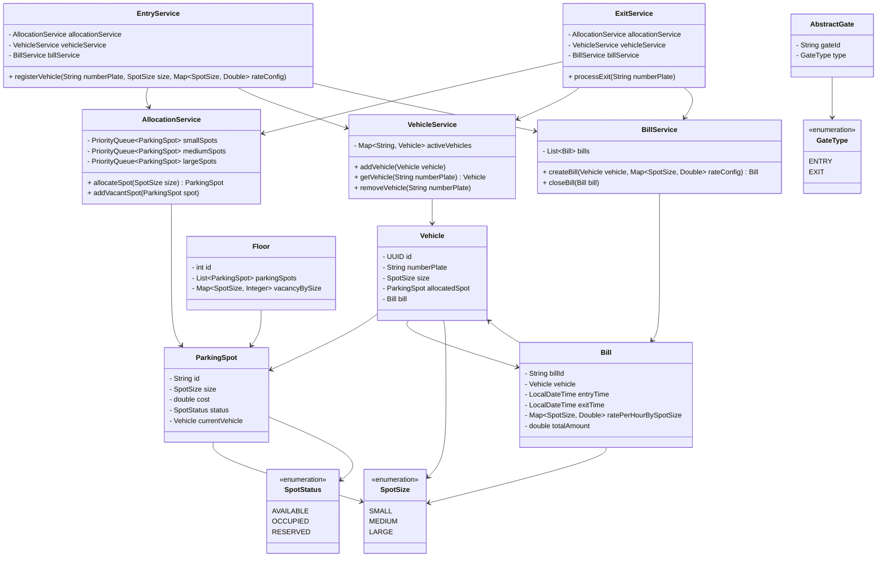

# Parking Lot Management System – Low Level Design (LLD)

---

# Overview

This system models a multi-floor parking lot that:

* Allocates parking spots based on vehicle size
* Uses min-heaps to assign the lowest-cost available spot
* Tracks active vehicles
* Creates a bill at entry and closes it at exit
* Maintains clean separation of responsibilities across services

This document contains:

* Full Class Diagram
* Detailed Process Flow (Dry Run)
* SOLID Principles Applied

---

# System Class Diagram

---

# Detailed Process Flow – Dry Run

## Initial State

AllocationService maintains three min-heaps:

SMALL → [S2(5), S1(10)]
MEDIUM → [M1(8), M2(15)]
LARGE → [L1(20)]

VehicleService:
activeVehicles = {}

BillService:
bills = []

---

# Scenario 1: Car Enters

Input:
Number Plate: GJ01AB1234
Size: MEDIUM

---

## Step 1 – EntryService Invocation

External system calls:

EntryService.registerVehicle(numberPlate, size, rateConfig)

Inside EntryService:

1. Create Vehicle object.
2. Call:

   vehicleService.addVehicle(vehicle)

VehicleService stores:

activeVehicles["GJ01AB1234"] = vehicle

Control returns to EntryService.

---

## Step 2 – Allocate Spot

EntryService calls:

allocationService.allocateSpot(size)

AllocationService:

* Accesses MEDIUM heap
* heap.poll() → M1 (cost 8)
* Removes M1 from heap
* Returns M1

Control returns to EntryService.

EntryService sets:

vehicle.allocatedSpot = M1
M1.currentVehicle = vehicle
M1.status = OCCUPIED

---

## Step 3 – Create Bill

EntryService calls:

billService.createBill(vehicle, rateConfig)

BillService:

1. Creates Bill object.
2. entryTime = current timestamp.
3. ratePerHourBySpotSize = rateConfig.
4. totalAmount = 0.
5. bill.vehicle = vehicle.
6. vehicle.bill = bill.
7. bills.add(bill).

Control returns to EntryService.

Entry flow complete.

---

# Scenario 2: Motorcycle Enters

Same flow:

EntryService
→ VehicleService
→ AllocationService (poll SMALL heap)
→ BillService

Heaps update accordingly.

---

# Scenario 3: Car Exits at 12:30 PM

External system calls:

ExitService.processExit("GJ01AB1234")

---

## Step 1 – Retrieve Vehicle

ExitService calls:

vehicleService.getVehicle("GJ01AB1234")

VehicleService returns Vehicle V1.

Control returns to ExitService.

---

## Step 2 – Retrieve Bill Directly from Vehicle

ExitService does:

Bill bill = vehicle.getBill()

No lookup required.
No iteration through BillService list.

---

## Step 3 – Close Bill

ExitService calls:

billService.closeBill(bill)

Inside BillService:

1. bill.exitTime = current timestamp.
2. duration = ceil(hours between entryTime and exitTime).
3. spotSize = bill.vehicle.allocatedSpot.size.
4. rate = bill.ratePerHourBySpotSize.get(spotSize).
5. bill.totalAmount = duration × rate.

Control returns to ExitService.

---

## Step 4 – Free Spot

ExitService retrieves:

spot = vehicle.getAllocatedSpot()

ExitService calls:

allocationService.addVacantSpot(spot)

AllocationService:

* spot.status = AVAILABLE
* spot.currentVehicle = null
* Adds spot back to correct heap (O(log n))

---

## Step 5 – Remove Vehicle

ExitService calls:

vehicleService.removeVehicle("GJ01AB1234")

Vehicle removed from activeVehicles.

Exit flow complete.

---

# SOLID Principles Applied

## 1. Single Responsibility Principle (SRP)

Each class has one clear responsibility:

* EntryService → Entry workflow
* ExitService → Exit workflow
* AllocationService → Spot allocation
* VehicleService → Active vehicle tracking
* BillService → Billing lifecycle
* Entities → State only

---

## 2. Open/Closed Principle (OCP)

System can be extended without modifying orchestration:

* Allocation strategy can change
* Pricing logic can evolve
* New spot sizes can be introduced

---

## 3. Liskov Substitution Principle (LSP)

AbstractGate can be extended (EntryGate, ExitGate) without breaking behavior.

---

## 4. Interface Segregation Principle (ISP)

Services expose only relevant methods.
No class is forced to depend on unused functionality.

---

## 5. Dependency Inversion Principle (DIP)

EntryService and ExitService depend on service abstractions rather than implementing allocation or billing logic directly.

They coordinate behavior rather than owning implementation details.

---

# Complexity

| Operation        | Complexity |
| ---------------- | ---------- |
| Allocate Spot    | O(log n)   |
| Free Spot        | O(log n)   |
| Retrieve Vehicle | O(1)       |
| Close Bill       | O(1)       |

---

# Conclusion

This design:

* Uses heap-based optimal allocation
* Maintains clear ownership (Vehicle owns Bill)
* Separates concerns cleanly
* Follows SOLID principles
* Is scalable and production-ready in structure
* Can be extended with concurrency control and persistence layers
