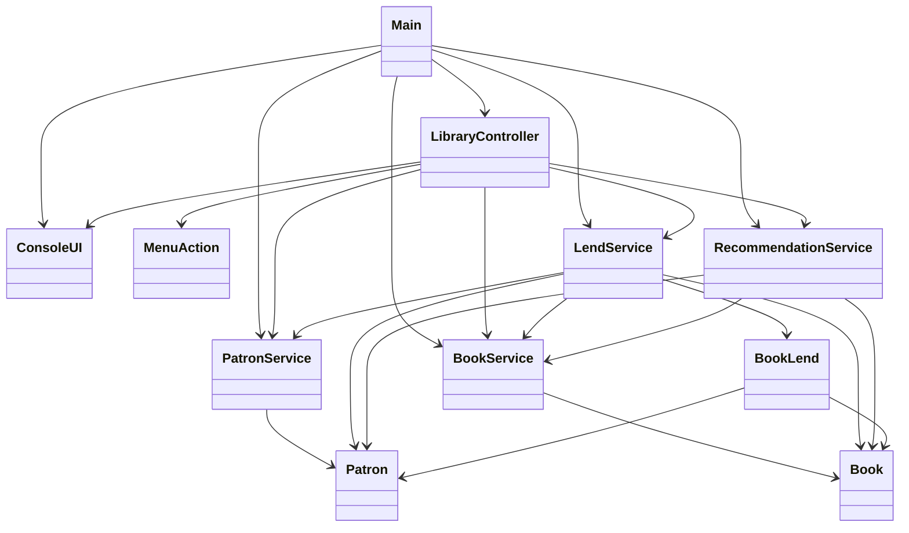

# LibTrack

A simple Java console application for tracking:
- Patrons
- Books
- Book lends/returns
- Genre-based recommendations
- Inventory status

## Run

Compile:
```powershell
javac Main.java ConsoleUI.java MenuAction.java LibraryController.java entities\*.java services\*.java
```

Run:
```powershell
java Main
```

## Features

- Create and manage patrons
- Create and manage books (with indexed lookups by ISBN, name, author, genre)
- Lend and return books
- Track patron genre history from lends
- Recommend available books by patron history
- Show inventory with `IN_LIBRARY` / `LENT_OUT` status

## SOLID In This Codebase

### S: Single Responsibility Principle
- `ConsoleUI.java`: only handles input/output for console.
- `LibraryController.java`: coordinates application use-cases and menu flow.
- `services/PatronService.java`: patron lifecycle logic.
- `services/BookService.java`: book lifecycle + search indexing.
- `services/LendService.java`: lend/return workflow.
- `services/RecommendationService.java`: recommendation logic only.
- `Main.java`: bootstrap/wiring only.

### O: Open/Closed Principle
- Menu actions are implemented using `MenuAction` and registered in maps in `LibraryController.java`.
- New menu options can be added by registering a new action, without modifying a large switch block.

### L: Liskov Substitution Principle
- `MenuAction` is used polymorphically in `LibraryController.java`; any implementation that respects `label()` and `execute()` can be substituted.

### I: Interface Segregation Principle
- `MenuAction.java` is a small, focused interface with only two methods (`label`, `execute`).
- Entity interfaces (`IBook`, `IPatron`, `IBookLend`) were intentionally not added. In this codebase, entities are concrete data models with distinct responsibilities, and there are no alternate implementations or polymorphic contracts needed for them today. Adding interfaces for these entities would introduce extra boilerplate without improving flexibility or testability. This keeps the design pragmatic and aligned with YAGNI, while still respecting ISP by avoiding broad, forced contracts.

### D: Dependency Inversion Principle
- Partially followed in menu behavior: `LibraryController.java` depends on the `MenuAction` abstraction for command execution.
- Service-layer dependencies currently remain concrete by design in this version.
- Service interfaces (`IBookService`, `IPatronService`, `ILendService`, etc.) were intentionally deferred. Right now each service has a single in-memory implementation and no runtime need for swapping providers. Introducing interfaces at this stage would add indirection and maintenance overhead without clear benefit. This is a deliberate YAGNI tradeoff: keep services concrete until multiple implementations, advanced testing seams, or external integrations justify abstraction.

## Class Diagram



## Project Structure

```text
.
├── Main.java
├── ConsoleUI.java
├── LibraryController.java
├── MenuAction.java
├── entities
│   ├── Patron.java
│   ├── Book.java
│   └── BookLend.java
└── services
    ├── PatronService.java
    ├── BookService.java
    ├── LendService.java
    └── RecommendationService.java
```
