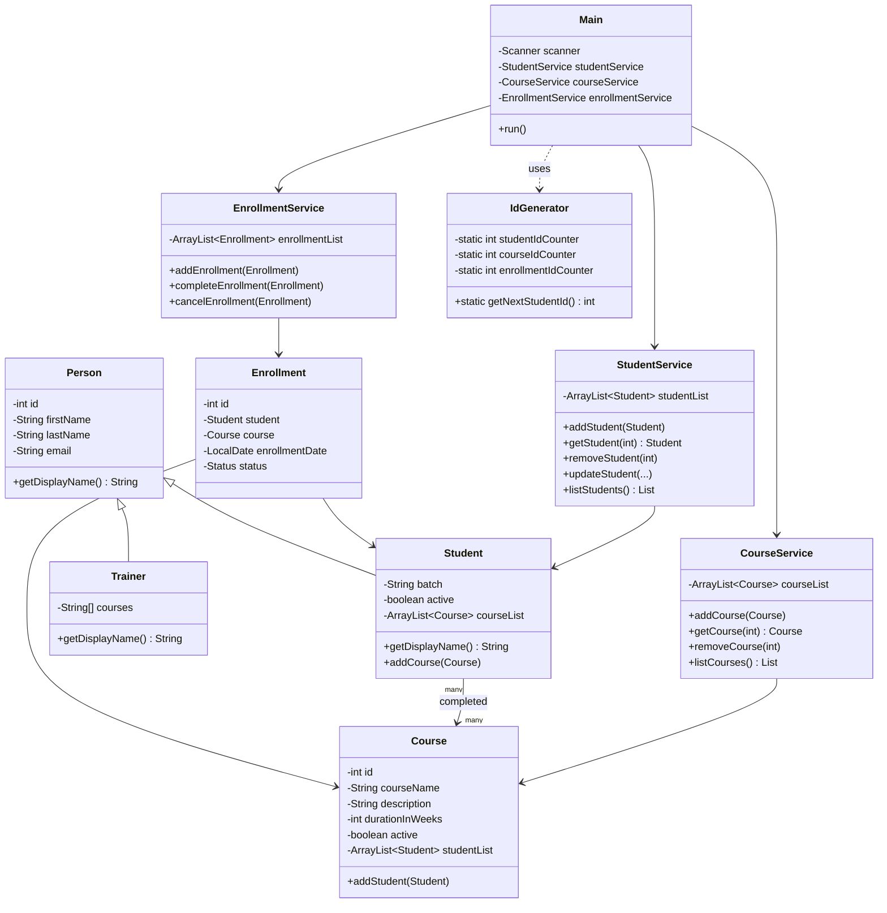

# LearnTrack

LearnTrack is a console-based Student & Course Management System built with Core Java. It lets an admin manage students, courses, and enrollments through a menu-driven terminal interface, entirely in memory (no database).

It was built as a learning project to practice: core Java syntax, OOP fundamentals (encapsulation, inheritance, polymorphism), constructors and constructor overloading, static members, collections (`ArrayList`), and basic exception handling.

## Features

- **Students** — add, view all, search by ID, deactivate
- **Courses** — add, view all, activate/deactivate
- **Enrollments** — enroll a student in a course, view a student's enrollment history, mark an enrollment completed or cancelled
- Auto-generated IDs (no manual ID entry) via `util.IdGenerator`
- Invalid input (bad menu choice, non-existent student/course ID, non-numeric input) is caught and shown as a clean message instead of crashing

## Project Structure

```
learntrack/
├── entities/     Student, Course, Enrollment, Person, Trainer
├── services/     StudentService, CourseService, EnrollmentService
├── ui/           Main.java - the console menu
├── exceptions/   EntityNotFoundException, InvalidInputException
├── util/         IdGenerator, InputValidator
└── docs/         Setup_Instructions.md, JVM_Basics.md, Design_Notes.md
```

## How to Compile and Run

From the project root:

```bash
# Compile everything into an "out" folder
javac -d out $(find . -name "*.java")

# Run the app
java -cp out ui.Main
```

(On Windows PowerShell, replace the compile line with:
`javac -d out (Get-ChildItem -Recurse -Filter *.java | ForEach-Object { $_.FullName })`)

## Class Diagram



## Design Notes

See [`docs/Design_Notes.md`](docs/Design_Notes.md) for the reasoning behind `ArrayList` vs. arrays, where static members are used, and what inheritance bought this project.
